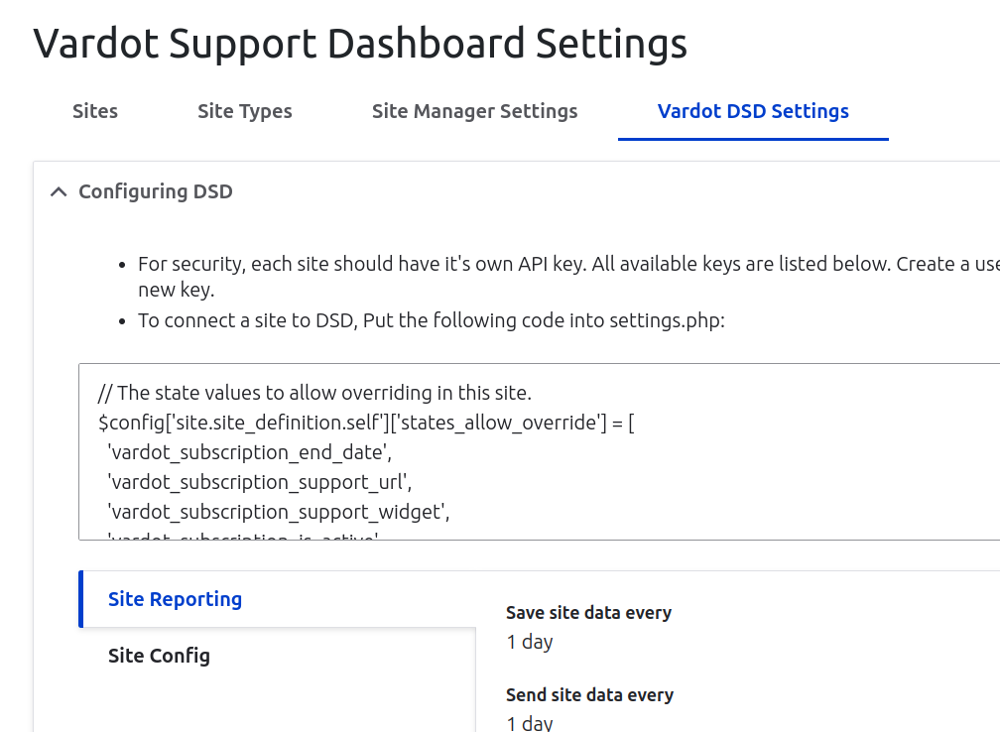
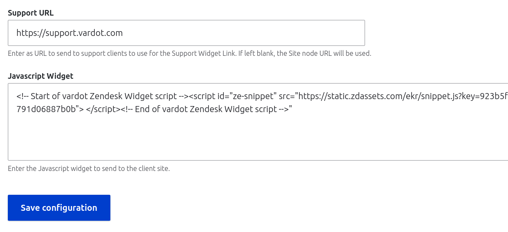
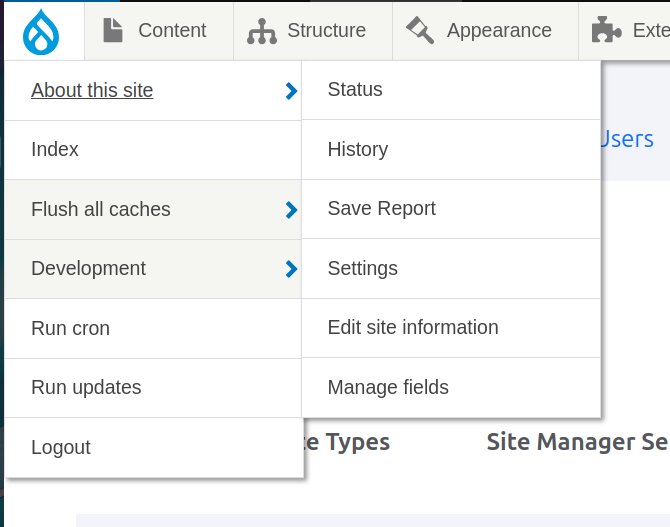
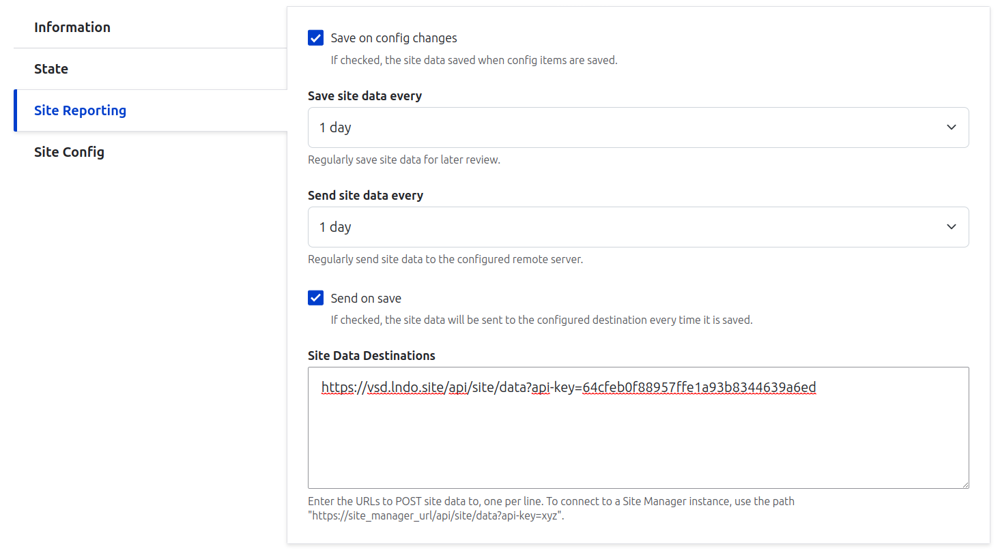
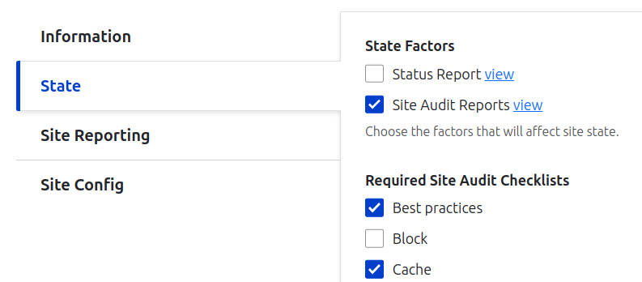

# Vardot Support Module

## Features

"Vardot Support" is a module used by Vardot for enhancing customer's Drupal sites by:

1. A list of dependencies we want installed in every site, such as:
   - Site Audit
   - Backup Migrate
   - Raven for Sentry support.
2. A standard global `settings.php` file.
   - Sets standard Drupal settings across projects.
   - Automatic Acquia hosting config.
   - Automatic Lando config.
   - Automatic inclusion of "settings.production.php" for various hosts when in "Production Mode".
3. Vardot Support-specific Site Audit Plugins.
4. Helpful composer bin scripts such as `git-rm-ignored`.
5. Boilerplate files for easy copying into projects, such as composer.json, .lando.yml, drush files, etc.

## Settings

This module is designed to make settings.php as automatic as possible.

The [settings.vardot.php](./settings/settings.vardot.php) file is designed to be included by your project's settings.php.

The [settings.default.php](./settings/settings.default.php) file is designed to be copied into new projects settings.php files.

When starting a new project with `composer create-project vardot/varbase_project`, the settings.php file will be copied automatically.

If updating a new project, review your current settings.php file and either replace it or alter it to include the contents of [settings.default.php](./settings/settings.default.php). 

### Acquia

The `drupal/vardot_support` global settings file will include the default Acquia settings file, or the `acquia/blt` settings file, if it exists and `AH_ENVIRONMENT` was detected.

See [settings.vardot.php, line 54](./settings/settings.vardot.php) for details.

### Custom Hosts

To make it easier for custom host providers to inform drupal of database credentials, Vardot Support module will
automatically set Drupal's `$databases` connection array using environment variables, if available.

To use this feature:

- Add `loadEnvironment.php` file (included in `vardot/varbase_project`).
- Add `"autoload": {"files": ["loadEnvironment.php]}` to `composer.json`.
- Write an `.env` file to the composer root containing the database credentials.

For example:

```
DRUSH_OPTIONS_URI=mysite.com
MYSQL_DATABASE=mysite
MYSQL_HOSTNAME=localhost
MYSQL_PASSWORD=secretpassword
MYSQL_PORT=3306
MYSQL_USER=mysite
```

The `varbase/varbase-project` includes these things by default.

### Lando

The `drupal/vardot_support` global settings file will include [settings.lando.php](./settings/settings.lando.php) if `LANDO` is detected.

This offers a few features:

- Sets `DRUSH_OPTIONS_URI` so all drush calls have the right URL set.
- No need to add LANDO environment detection and settings to a project's `settings.php`.
- Automatically configures `$databases` from `LANDO_INFO`.
- Sets `$settings['hash_salt']`.
- Sets `$settings['trusted_host_patterns']` for lndo.site and lando's "share" feature, localtunnel.me.
- Enables "Developer mode" automatically by including Drupal's `example.settings.local.php`. (To skip this feature, set `LANDO_PROD_MODE` in lando.yml.)
- Disables redirect to www when using `drupal/httpswww` module.
- More TBD.

## Vardot Drupal Support

This module uses the [Site Entity Module](https://www.drupal.org/project/site) to track status of your website, and to connect to the Vardot Support Network.

When enabled, your site will send status updates to the Vardot Drupal Support Dashboard to help us ensure the quality of your website.

### Setup

To connect a site to the Vardot Drupal Support Dashboard, follow these instructions:

#### In DSD:

1. Create a new user for each client and API key.
  1. Sign into Vardot DSD.
  2. Create a user for the client, or use another trusted user.
  3. Visit that user's account page (/user/X), and click "Key Authentication", then "Generate new Key" if necessary. 
     Save the key for later.
  4. Visit "Sites" > "Vardot DSD Settings" to view the needed settings for a client site.
     
  5. Apply those settings to the client site either via settings.php or in the web UI of the client site.
  6. Check Vardot DSD Settings page to edit the support widget and URL.
     

#### In Client Site:

1. Add and enable Vardot Support module:

        composer require drupal/vardot_support
        drush en vardot_support 

    You will likely have to remove some dependencies from the project. Vardot Support requires some modules. Remove them 
  from the project to allow vardot_support to be included.

2. Configure Site.module to send reports to DSD:
   1. Open the new "About this Site" > "Settings" page under the top left menu. (/admin/about/site):
      
   2. Ensure the settings are applied as shown on the DSD Settings page either to the client site's settings.php or manually on the "About this site > Settings" page.
      
   3. For the "Site Data Destinations" field, enter the URL of the DSD Site with the API key created on the DSD site, like so:
   
        > https://dsdsite.vardot.com/api/site/data?api-key=xyz

   4. Configure the desired State Factors for the site under the "State" tab.
      

3. Set up Vardot Support Status and Remote Login Links
   1. Get API key from the Client site. 
      1. The DSD needs an API key from the client site to authenticate and retrieve login links.
      2. Sign into the client site. Visit My Account > Key Authentication and click "Generate new Key".
      3. Copy the Key and head to the DSD.
   2. Add API key to Site Entity in DSD
      1. Sign into DSD site.
      2. Visit "Sites" page.
      3. Scroll down to the Site Entity you are connecting and click the title to visit the Site Entity page.
      4. Click the "Edit" tab.
      5. Edit the "Vardot Support Expires" field as needed.
      6. Fill in the "API Key" field for that site.
      7. The API URL field can be left blank. For extra security, you could host the site under a separate domain for this API access.
      8. Hit Save Button.
   3. Sign into client site from DSD:
      1. Visit the DSD Site Entity page: Click "Sites" > Site Title.
      2. Click "Get Login Link" fieldset to expand the form.
      3. Enter your DSD password into "Confirm Password" field. If you do not have one, ask an adminitrator to create one for you.
      4. Press "Request login link from SITENAME".
      5. If successful, you will see a one-time-login link in the status messages. It will only be shown once. Copy it before leaving the page.
   4. Update client site Vardot Support status.
      1. Now that the DSD Site Entity has the Vardot Expires date, visit the client site.
      2. Click "About this site" > "Save Report" to send an update and retrieve the latest Vardot Support data.
      3. Clear caches to see the updated state in the Vardot Support toolbar widget.
      4. Confirm that the Vardot Support widget is embedded.

## About

For more information, contact Vardot at https://www.vardot.com/en-us/contact-us.

